<div align="center">
  <h1>flowbite-vue</h1>
  <p>
    <a href="https://flowbite.com">
      
    </a>
  </p>
  <p>
    Build websites even faster with components on top of Vue and Tailwind CSS
  </p>
  <p>
    <a href="https://codecov.io/gh/themesberg/flowbite-vue">
      
    </a>
    <a href="https://discord.com/invite/4eeurUVvTy">
      
    </a>
    <a href="https://www.npmjs.com/package/flowbite-vue">
      
    </a>
    <a href="https://badge.fury.io/js/flowbite-vue">
      
    </a>
    <a href="https://flowbite.com/getting-started/license/">
      
    </a>
  </p>
</div>

---

### `flowbite-vue` is an open source collection of UI components, built in Vue, with utility classes from Tailwind CSS that you can use as a starting point for user interfaces and websites.

## Table of Contents

- [Documentation](#documentation)
- [Getting started](#getting-started)
    - [Require via `npm`](#require-via--npm-)
    - [Include via CDN](#include-via-cdn)
- [Components](#components)
- [Community](#community)
- [Contributing](#contributing)
- [Figma](#figma)
- [Copyright and license](#copyright-and-license)

## Documentation

Documentation for `flowbite-vue` is not yet finished.

If you want to browse the components, visit [flowbite.com](https://flowbite.com/).

If you want to learn more about Flowbite, visit [Flowbite docs](https://flowbite.com/docs/getting-started/introduction/).

## Getting started

To use `flowbite-vue`, you just need to setup `flowbite` normally and install `flowbite-vue` from `npm`.

`flowbite` can be included as a plugin into an existing Tailwind CSS project.

### Require via `npm`

Make sure that you have <a href="https://nodejs.org/en/" rel="nofollow" >Node.js</a> and <a href="https://tailwindcss.com/" rel="nofollow" >Tailwind CSS</a> installed.

1. Install `flowbite` as a dependency using `npm` by running the following command:

```bash
npm i flowbite flowbite-vue
```

2. Require `flowbite` as a plugin inside the `tailwind.config.js` file:

```javascript
module.exports = {
  content: [
    ...,
    'node_modules/flowbite-vue/**/*.{js,jsx,ts,tsx}'
  ],
  plugins: [..., require('flowbite/plugin')],
};
```

## Components

<table>
  <tr>
    <td width="33.3333%">Alerts</td>
    <td width="33.3333%">Badge</td>
    <td width="33.3333%">Breadcrumbs</td>
  </tr>
  <tr>
    <td width="33.3333%">
        <a href="https://flowbite-vue.com/components/alert">
            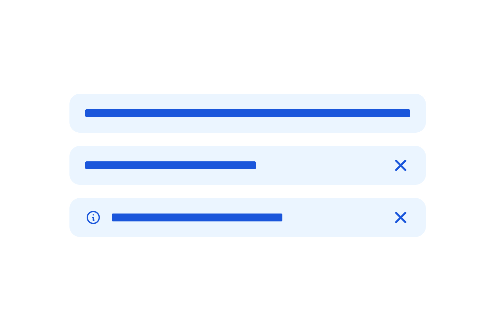
        </a>
    </td>
    <td width="33.3333%">
        <a href="https://flowbite-vue.com/components/badge">
            
        </a>
    </td>
    <td width="33.3333%">
        <a href="https://flowbite-vue.com/components/breadcrumb">
            
        </a>
    </td>
  </tr>
  <tr>
    <td width="33.3333%">Buttons</td>
    <td width="33.3333%">Button group</td>
    <td width="33.3333%">Cards</td>
  </tr>
  <tr>
    <td width="33.3333%">
        <a href="https://flowbite-vue.com/components/button">
            
        </a>
    </td>
    <td width="33.3333%">
        <a href="https://flowbite-vue.com/components/button-group">
            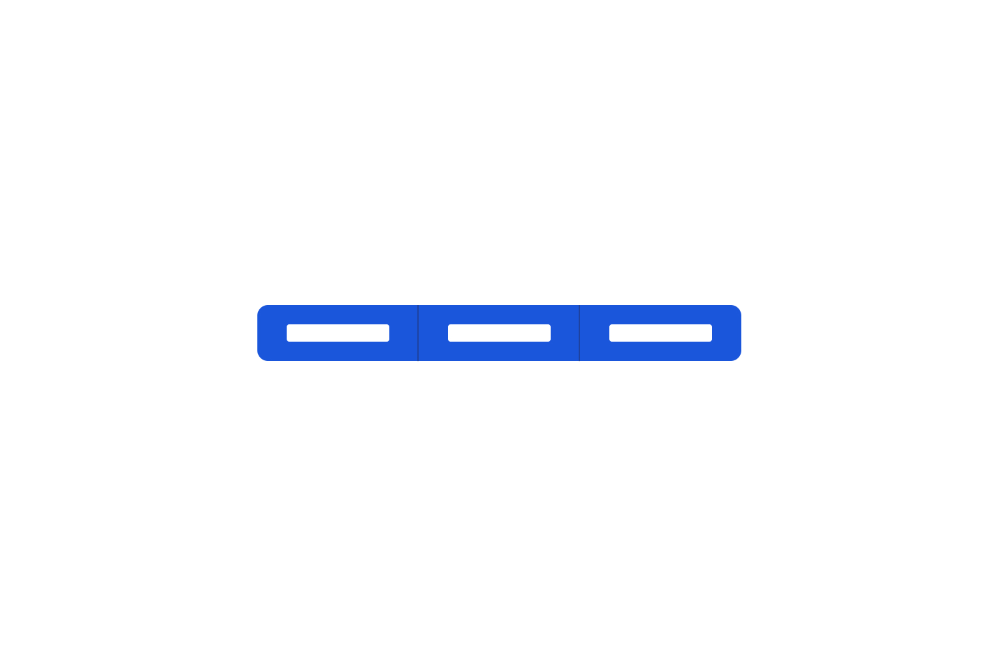
        </a>
    </td>
    <td width="33.3333%">
        <a href="https://flowbite-vue.com/components/card">
            
        </a>
    </td>
  </tr>
  <tr>
    <td width="33.3333%">Dropdown</td>
    <td width="33.3333%">:construction: Forms</td>
    <td width="33.3333%">List group</td>
  </tr>
  <tr>
    <td width="33.3333%">
        <a href="https://flowbite-vue.com/components/dropdown">
            
        </a>
    </td>
    <td width="33.3333%">
        <a href="https://flowbite-vue.com/components/input">
            
        </a>
    </td>
    <td width="33.3333%">
        <a href="https://flowbite-vue.com/components/list-group">
            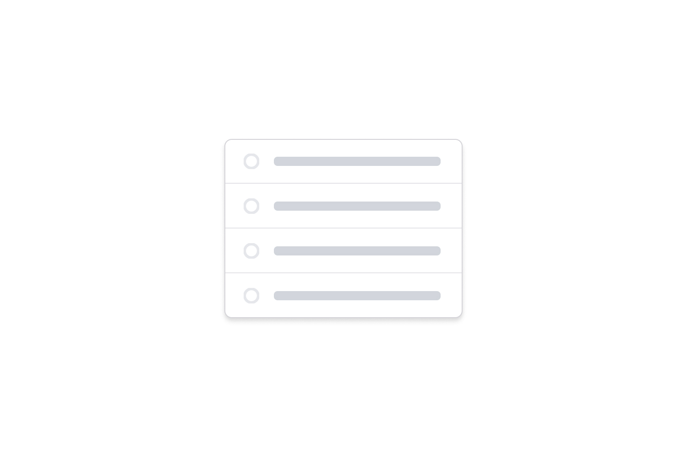
        </a>
    </td>
  </tr>
  <tr>
    <td width="33.3333%">:construction: Typography</td>
    <td width="33.3333%">Modal</td>
    <td width="33.3333%">Tabs</td>
  </tr>
  <tr>
    <td width="33.3333%">
        <a href="https://flowbite.com/docs/components/typography/">
            
        </a>
    </td>
    <td width="33.3333%">
        <a href="https://flowbite-vue.com/components/modal">
            
        </a>
    </td>
    <td width="33.3333%">
        <a href="https://flowbite-vue.com/components/tabs">
            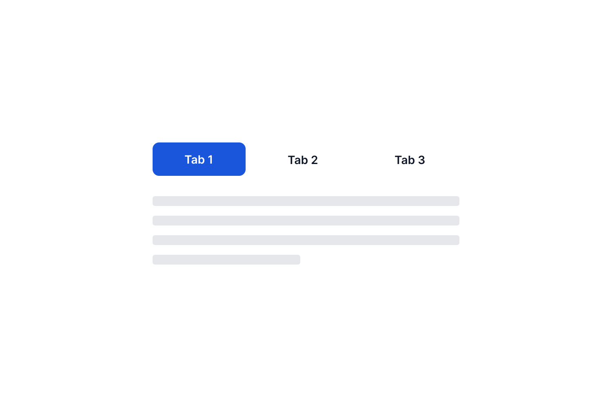
        </a>
    </td>
  </tr>
  <tr>
    <td width="33.3333%">Navbar</td>
    <td width="33.3333%">Pagination</td>
    <td width="33.3333%">Timeline</td>
  </tr>
  <tr>
    <td width="33.3333%">
        <a href="https://flowbite-vue.com/components/navbar">
            
        </a>
    </td>
    <td width="33.3333%">
        <a href="https://flowbite-vue.com/components/pagination">
            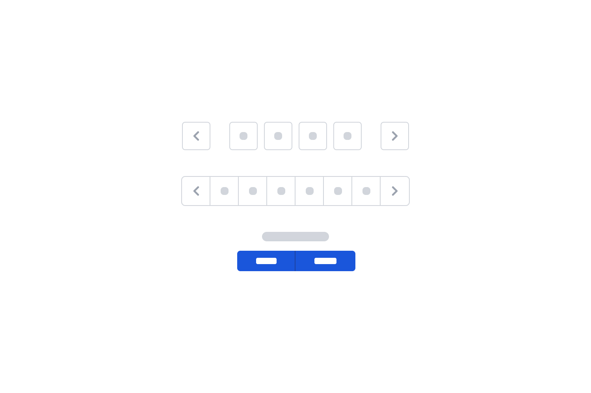
        </a>
    </td>
    <td width="33.3333%">
        <a href="https://flowbite-vue.com/components/timeline">
            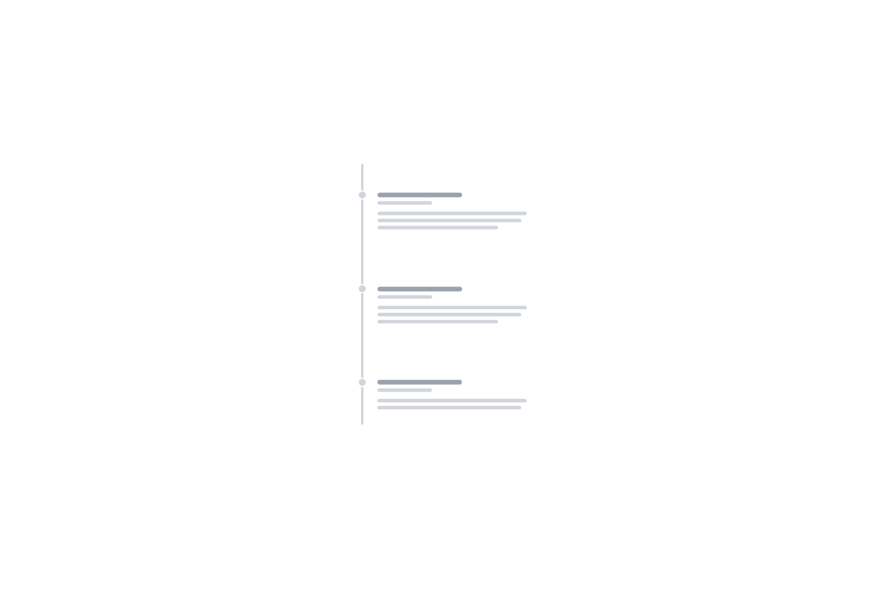
        </a>
    </td>
  </tr>
  <tr>
    <td width="33.3333%">Progress bar</td>
    <td width="33.3333%">Tables</td>
    <td width="33.3333%">Toast</td>
  </tr>
  <tr>
    <td width="33.3333%">
        <a href="https://flowbite-vue.com/components/progress">
            
        </a>
    </td>
    <td width="33.3333%">
        <a href="https://flowbite-vue.com/components/table">
            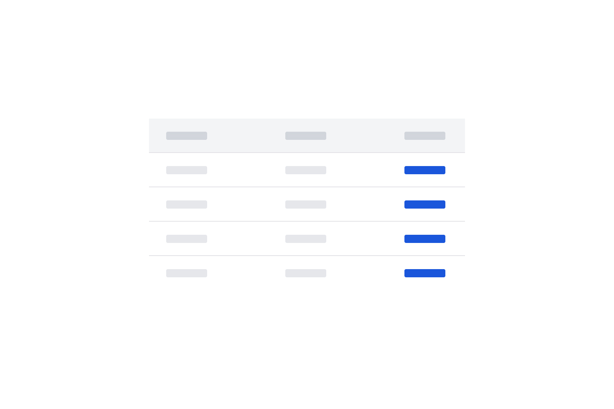
        </a>
    </td>
    <td width="33.3333%">
        <a href="https://flowbite-vue.com/components/alert">
            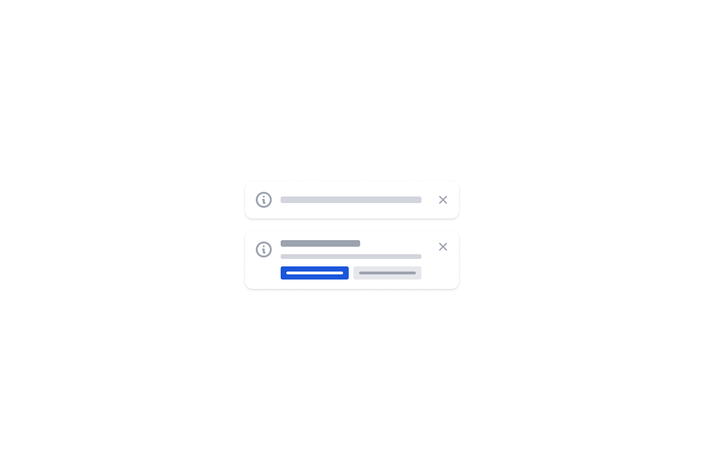
        </a>
    </td>
  </tr>
  <tr>
    <td width="33.3333%">Tooltips</td>
    <td width="33.3333%">:construction: Datepicker</td>
    <td width="33.3333%">Spinner</td>
  </tr>
  <tr>
    <td width="33.3333%">
        <a href="https://flowbite-vue.com/components/tooltip">
            
        </a>
    </td>
    <td width="33.3333%">
        <a href="https://flowbite.com/docs/plugins/datepicker">
            
        </a>
    </td>
    <td width="33.3333%">
        <a href="https://flowbite-vue.com/components/spinner">
            
        </a>
    </td>
  </tr>
  <tr>
    <td width="33.3333%">Footer</td>
    <td width="33.3333%">Accordion</td>
    <td width="33.3333%">:construction: Sidebar</td>
  </tr>
  <tr>
    <td width="33.3333%">
        <a href="https://flowbite-vue.com/components/footer">
            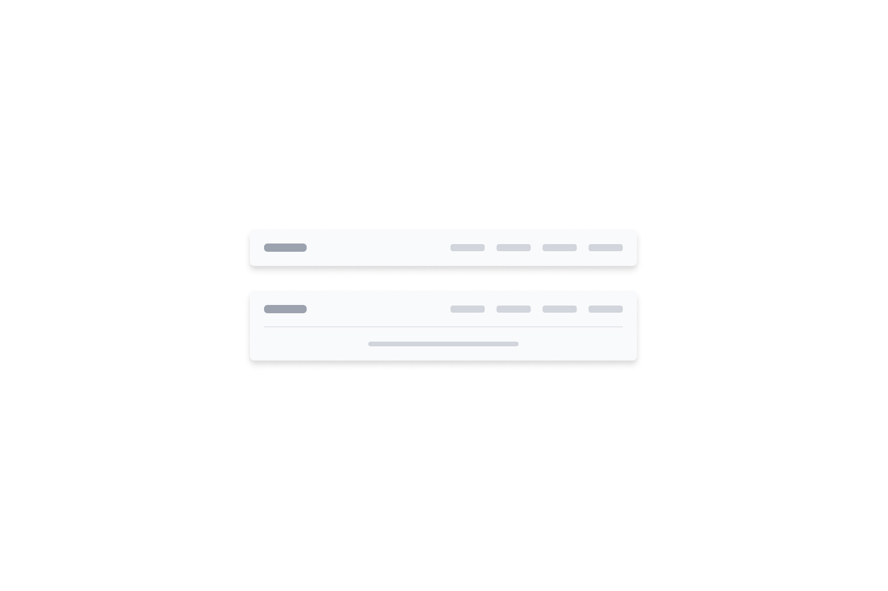
        </a>
    </td>
    <td width="33.3333%">
        <a href="https://flowbite-vue.com/components/accordion">
            
        </a>
    </td>
    <td width="33.3333%">
        <a href="https://flowbite-vue.com/components/sidebar">
            
        </a>
    </td>
  </tr>
  <tr>
    <td width="33.3333%">Carousel</td>
    <td width="33.3333%">Avatar</td>
    <td width="33.3333%">Rating</td>
  </tr>
  <tr>
    <td width="33.3333%">
        <a href="https://flowbite-vue.com/components/carousel">
            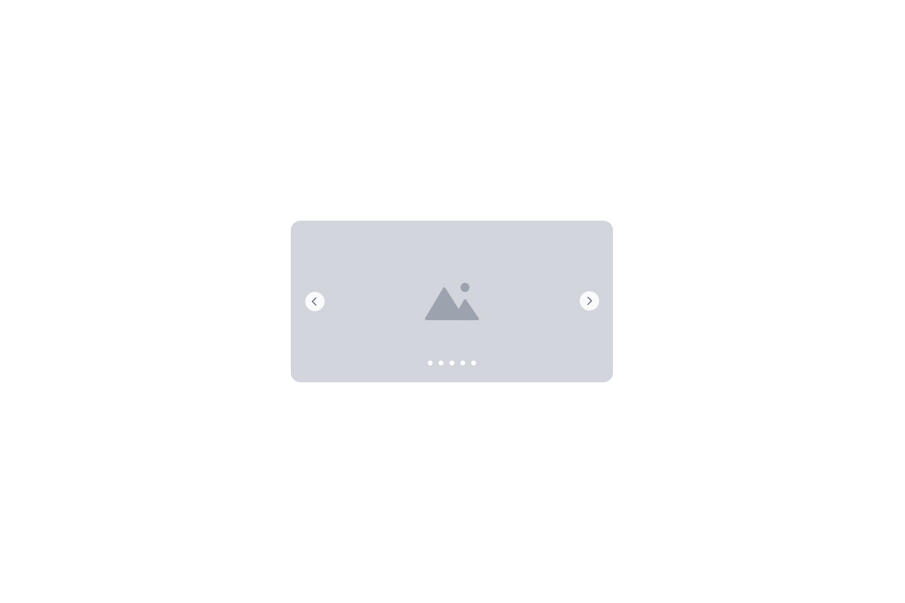
        </a>
    </td>
    <td width="33.3333%">
        <a href="https://flowbite-vue.com/components/avatar">
            
        </a>
    </td>
    <td width="33.3333%">
        <a href="https://flowbite-vue.com/components/rating">
            
        </a>
    </td>
  </tr>
  <tr>
    <td width="33.3333%">Input Field</td>
    <td width="33.3333%">File Input</td>
    <td width="33.3333%">:construction: Search Input</td>
  </tr>
  <tr>
    <td width="33.3333%">
        <a href="https://flowbite-vue.com/components/input">
            
        </a>
    </td>
    <td width="33.3333%">
        <a href="https://flowbite-vue.com/components/fileInput">
            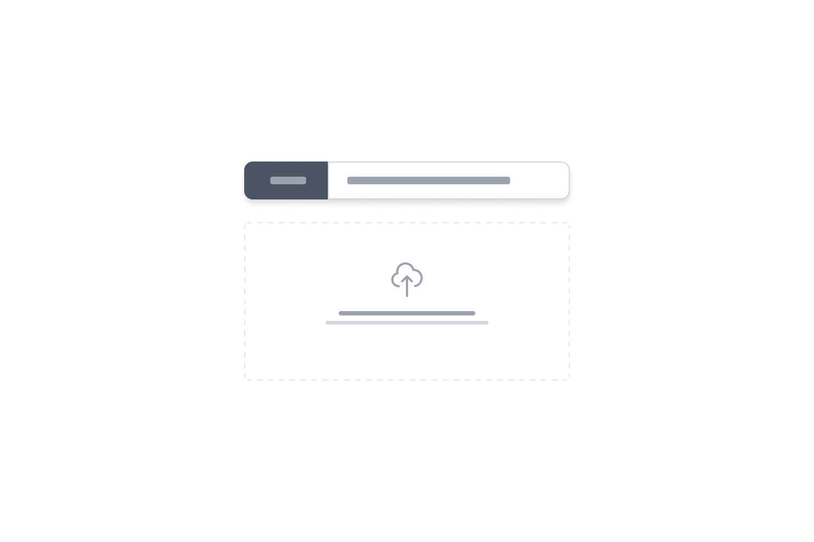
        </a>
    </td>
    <td width="33.3333%">
        <a href="https://flowbite.com/docs/forms/search-input/">
            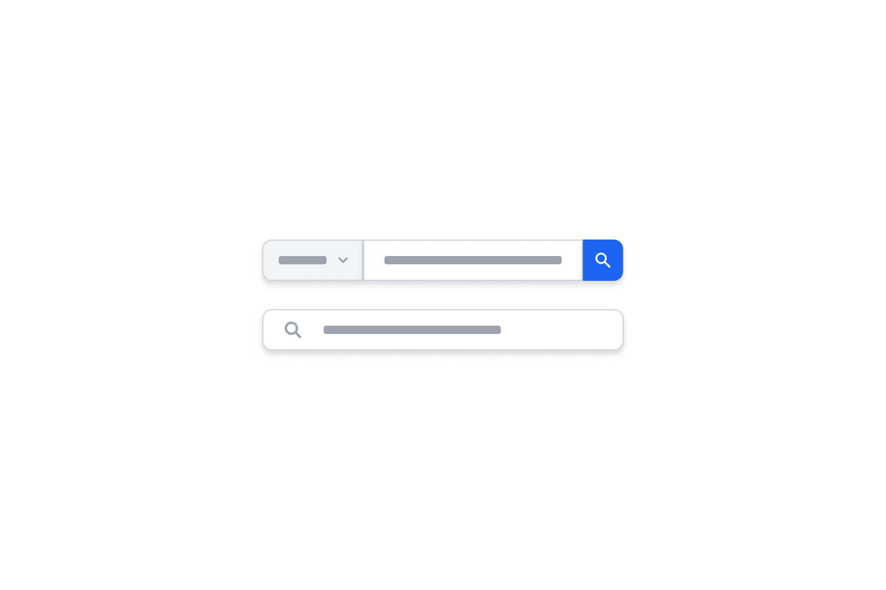
        </a>
    </td>
  </tr>
  <tr>
    <td width="33.3333%">Select</td>
    <td width="33.3333%">Textarea</td>
    <td width="33.3333%">Checkbox</td>
  </tr>
  <tr>
    <td width="33.3333%">
        <a href="https://flowbite-vue.com/components/select">
            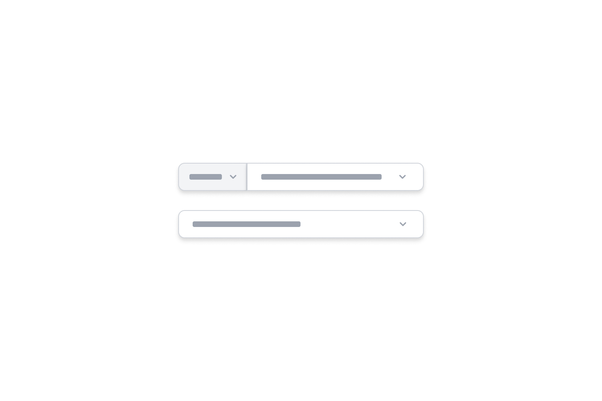
        </a>
    </td>
    <td width="33.3333%">
        <a href="https://flowbite-vue.com/components/textarea">
            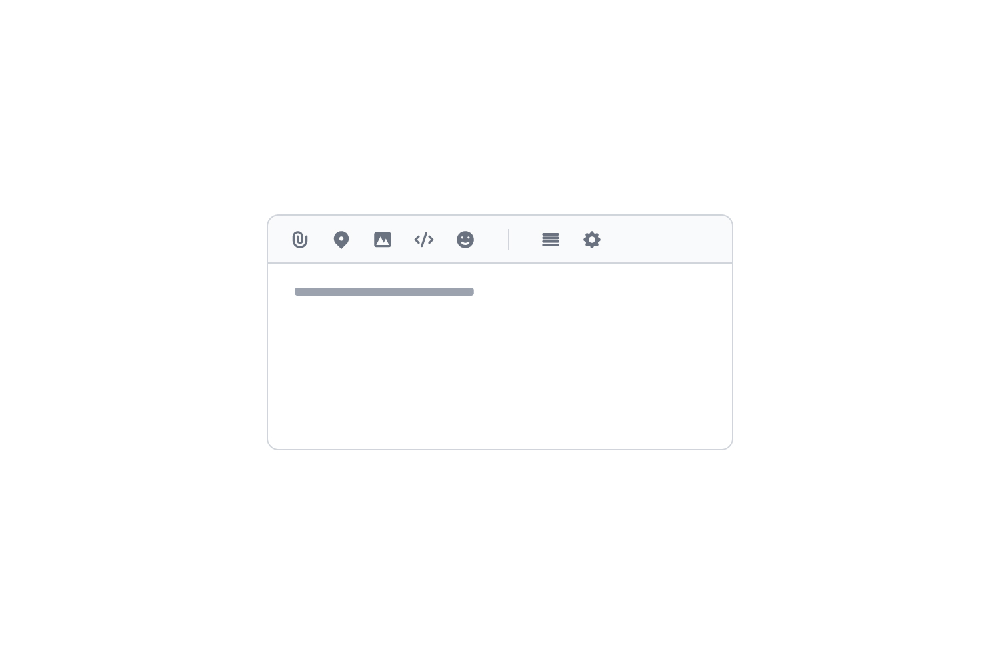
        </a>
    </td>
    <td width="33.3333%">
        <a href="https://flowbite-vue.com/components/checkbox">
            
        </a>
    </td>
  </tr>
  <tr>
    <td width="33.3333%">Radio</td>
    <td width="33.3333%">Toggle</td>
    <td width="33.3333%">Range Slider</td>
  </tr>
  <tr>
    <td width="33.3333%">
        <a href="https://flowbite-vue.com/components/radio">
            
        </a>
    </td>
    <td width="33.3333%">
        <a href="https://flowbite-vue.com/components/toggle">
            
        </a>
    </td>
    <td width="33.3333%">
        <a href="https://flowbite.com/docs/forms/range/">
            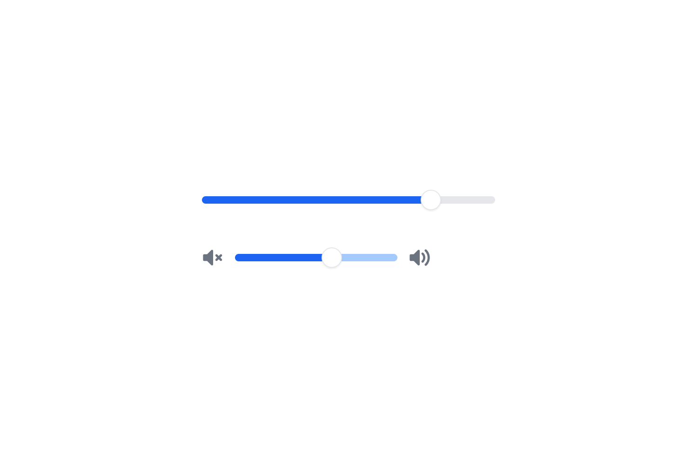
        </a>
    </td>
  </tr>
  <tr>
    <td width="33.3333%">:construction: Floating Label</td>
  </tr>
  <tr>
    <td width="33.3333%">
        <a href="https://flowbite.com/docs/forms/floating-label/">
            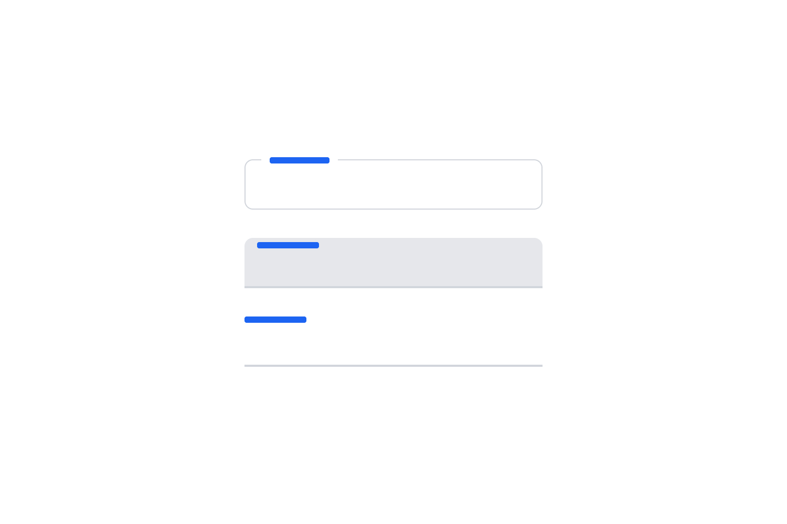
        </a>
    </td>
  </tr>
</table>

## Community

If you need help or just want to discuss about the library join the community on Github:

⌨️ [Discuss about Flowbite on GitHub](https://github.com/themesberg/flowbite/discussions)

For casual chatting with others using the library:

💬 [Join the Flowbite Discord Server](https://discord.gg/4eeurUVvTy)

## Contributing

Thank you for your interest in helping! Visit our [guide on contributing](https://github.com/themesberg/flowbite-vue/blob/main/CONTRIBUTING.md) to get started.

## Figma

If you need the Figma files for the components you can check out our website for more information:

🎨 [Get access to the Figma design files](https://flowbite.com/figma/)

## Copyright and license

The Flowbite name and logos are trademarks of Crafty Dwarf Inc.

📝 [Read about the licensing terms](https://flowbite.com/getting-started/license/)
